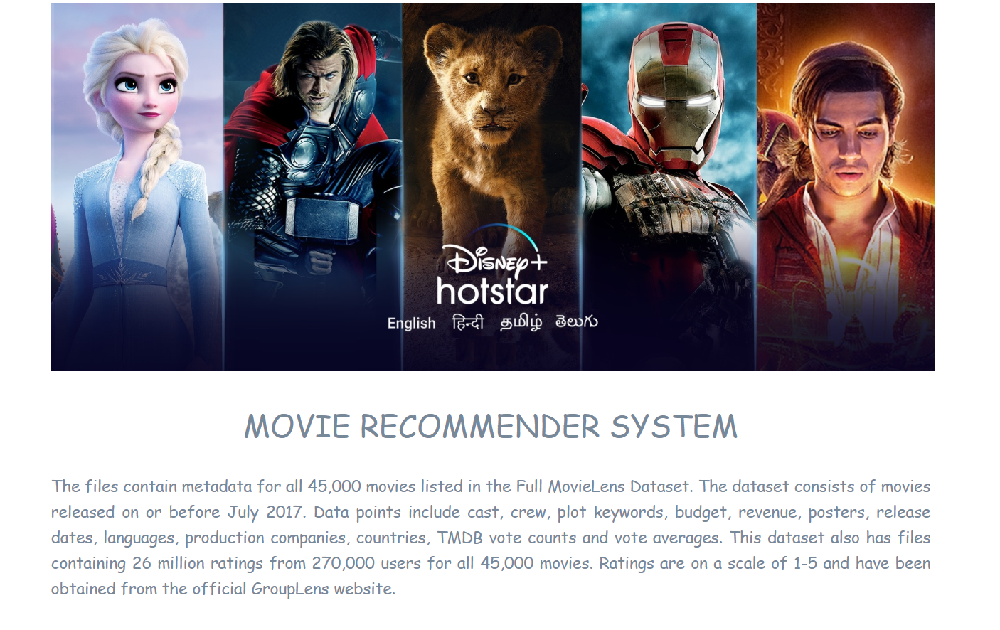

# Movie Recommender System
# Data Repo : https://grouplens.org/datasets/movielens/latest/

# Required Installations
1. pip install requests  
2. pip install responses
3. pip install ipywidgets (https://ipywidgets.readthedocs.io/en/latest/user_install.html)
4. pip install voila

# For Hosting the NoteBook 
1. Used Voila 
